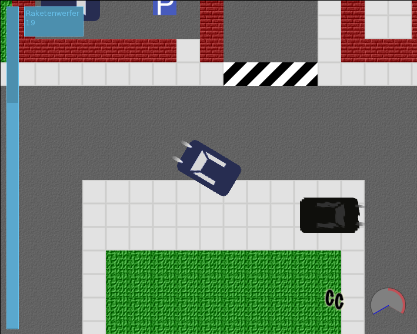

.. Copyright © 2014, 2016-2017 Martin Ueding <dev@martin-ueding.de>

#########
wolverine
#########

This is a hit and run kind of game that I wrote around 2010. You can run
around, drive cars and shoot with a rocket launcher.

Download
========

This is the compiled game: `<wolverinegame.jar>`_

Controls
========

.. list-table::
    :header-rows: 1

    - - Button
      - Normal
      - In car
    - - :kbd:`Enter`
      - Enter car
      - Exit car
    - - :kbd:`a`
      - Open/close door, collect life or ammunition
      - Toggle speed limiter
    - - :kbd:`f`
      - Fire rocket launcher
      -
    - - :kbd:`↑`
      - Move forward
      - Accelerate
    - - :kbd:`↓`
      - Move backwards
      - Deccelerate
    - - :kbd:`→`
      - Turn right
      - Turn right
    - - :kbd:`←`
      - Turn left
      - Turn left
